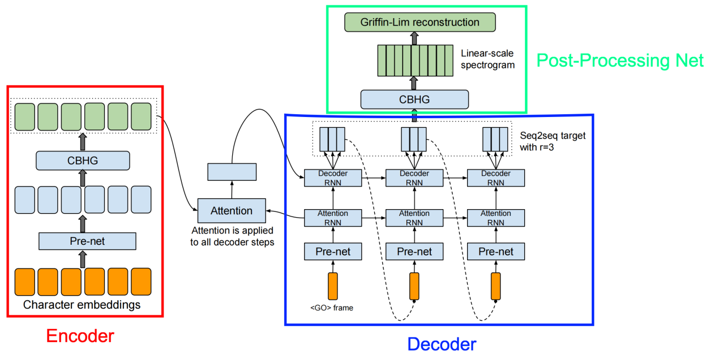
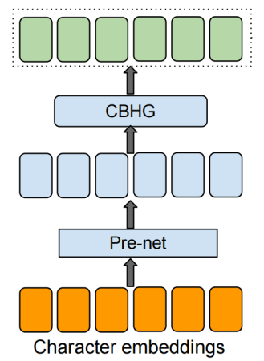
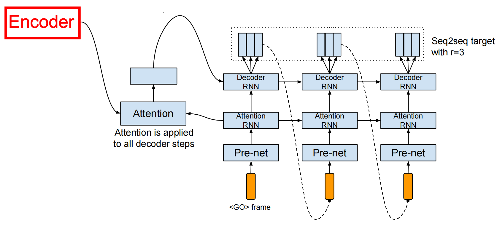
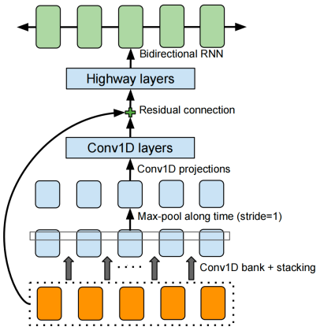
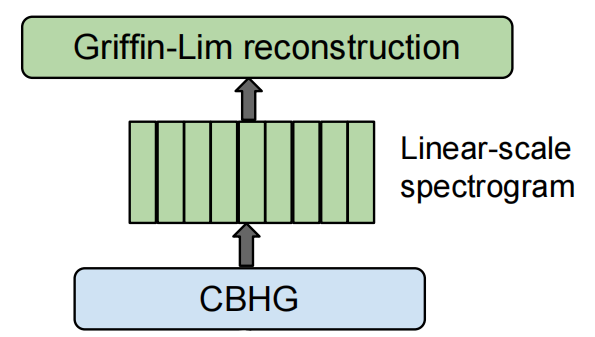
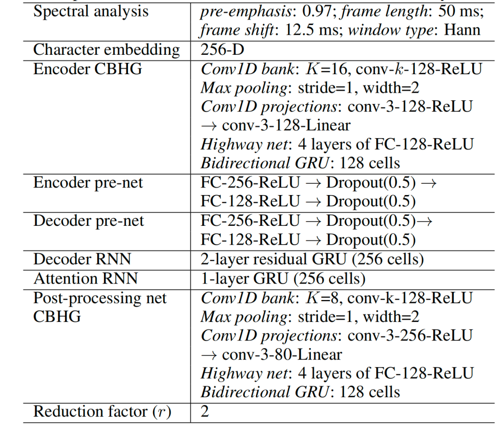
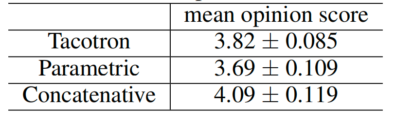

# Tacotron — README

Tacotron là một thiên tài âm nhạc, mới đẻ ra chưa biết gì hết (random initialization), nhưng có một siêu năng lực là nhái giọng.

## Bé Tacotron học nói như thế nào? 👶

Bạn không thể dạy nó từng âm "a", "b", "c" một cách riêng lẻ được, bé nó không thích! Thay vào đó, bạn cho nó xem một cuốn truyện có hình (chữ - text) và bật băng cassette cho nó nghe người ta đọc cuốn truyện đó (âm thanh - audio).

Cứ thế ngày qua ngày, bé Tacotron vừa nhìn chữ, vừa nghe âm thanh. Dần dần, bộ não thiên tài của nó tự "nảy số" và hiểu ra: "Àaaa, cái chữ 'mèo' này thì phải phát âm trầm bổng lên xuống như thế này đây!".

Nó học một cách "end-to-end", tức là bạn chỉ cần quẳng cho nó cả đống truyện và băng, nó sẽ tự lo phần còn lại.

## Quá trình "tạo ra giọng nói" 2 bước của bé Tacotron 🎤

Bé Tacotron thực ra không tự phát ra tiếng nói. Nó giống một nhà soạn nhạc thiên tài hơn là một ca sĩ.

**Bước 1: Soạn "Bản Đồ Âm Thanh" (Spectrogram)** Khi bạn đưa cho nó một câu văn mới, ví dụ "Trời hôm nay đẹp quá!", bé Tacotron sẽ dùng trí tuệ của mình để vẽ ra một "bản đồ âm thanh" hay "bản nhạc phổ" siêu chi tiết. Bản đồ này trông rất loằng ngoằng, nhưng nó ghi lại chính xác: chỗ nào cần lên giọng, chỗ nào xuống giọng, ngân dài bao lâu, v.v.

Nói tóm lại, nó tạo ra công thức để tạo ra âm thanh, chứ chưa phải là âm thanh thật.

**Bước 2: Thuê Ca Sĩ Chuyên Nghiệp (Vocoder)** Sau khi soạn xong bản nhạc, bé Tacotron sẽ đưa nó cho một người bạn thân tên là Vocoder. Anh chàng Vocoder này là một ca sĩ/rapper chuyên nghiệp, không cần biết chữ, chỉ cần nhìn bản đồ âm thanh là có thể "hát" ra thành sóng âm (waveforms) chuẩn không cần chỉnh.

=> Thế là bạn có giọng nói của chị Google!

## "Nội Tạng" của bé Tacotron gồm những gì? 🧠

 
Bên trong bộ não của bé Tacotron có một đội ngũ làm việc như một công ty chuyên nghiệp:

**Encoder (Thánh Soi Chữ):** Anh chàng này có nhiệm vụ đọc văn bản bạn đưa vào. Nó phân tích từng chữ, hiểu ngữ cảnh và tóm tắt lại ý nghĩa của câu văn thành một dạng ngôn ngữ "chỉ AI mới hiểu".

**Decoder (Nhà Soạn Nhạc):** Dựa trên bản tóm tắt của "Thánh Soi Chữ", anh chàng này bắt đầu quá trình sáng tác ra cái "bản đồ âm thanh" loằng ngoằng ở trên.

**Attention Mechanism (Giám Thị Khó Tính):** Đây là nhân vật quan trọng nhất! Trong lúc "Nhà Soạn Nhạc" đang làm việc, "Giám Thị" sẽ liên tục dí vào đầu nó và la lên: "Ê, đang đọc đến chữ 'hôm' rồi đấy nhé, tập trung vào chữ 'hôm' đi, đừng có nhìn sang chữ 'nay' vội!". Nhờ có ông giám thị này mà Tacotron không bị "lú" và đọc nhầm từ này sang từ khác.

**Post-processing Network (Phù Thủy Make-up):** Sau khi bản đồ âm thanh được vẽ xong, có thể nó vẫn còn hơi "thô". Mạng lưới này sẽ nhảy vào "tút tát", "cà khịa" lại cho nó mượt mà, bóng bẩy hơn trước khi đưa cho ca sĩ Vocoder. ✨

---

## Encoder (Phòng Phân Tích & Mã Hóa Thông Tin) 🕵️‍♂️

 

Đây là bộ phận đầu vào, nơi tiếp nhận "đơn hàng" của khách (chính là câu văn bạn gõ vào). Trưởng phòng ở đây là một anh chàng Encoder siêu lập dị nhưng cực kỳ thông minh.

**Quy trình làm việc của Encoder:**

* Nhận đơn hàng: Khách hàng đưa một mẩu giấy ghi chữ "Hello".
* Quét mã vạch: Encoder không đọc được chữ bình thường. Anh ta lấy máy quét, biến mỗi chữ cái ('H', 'e', 'l', 'l', 'o') thành một cái mã vạch độc nhất (one-hot vector). Sau đó, anh ta tra cuốn "Từ Điển Bí Truyền Của AI" để hiểu ý nghĩa sâu xa của từng mã vạch đó (character embeddings).
* Cho vào "Phễu Lọc Não" (Pre-net): Trước khi báo cáo lên sếp, Encoder cho mớ thông tin này qua một cái phễu lọc. Cái phễu này giúp tóm gọn ý chính và vứt bớt những chi tiết râu ria. Thỉnh thoảng, anh ta còn giả vờ "lỡ tay" làm rơi vài mẩu thông tin nhỏ (dropout). Việc "đãng trí" có chủ đích này lại hay, nó giúp cả hệ thống không bị quá máy móc và học cách ứng biến tốt hơn.
* Trình lên "Siêu Trợ Lý" CBHG: Cuối cùng, bản tóm tắt được đưa cho một trợ lý tên là CBHG. Anh chàng CBHG này đọc đi đọc lại bản báo cáo, ngó trước ngó sau để hiểu toàn bộ ngữ cảnh, rồi nén nó lại thành một file "siêu cô đọng" và "siêu trí tuệ". Bản báo cáo cuối cùng này chất lượng đến mức nó giúp giảm thiểu tối đa việc team sau này đọc sai từ.

=> Kết quả: Từ một câu chữ đơn giản, phòng Encoder đã tạo ra một bản báo cáo mã hóa siêu ngầu, chứa đựng toàn bộ tinh hoa của câu nói đó.

---

## Decoder + Attention Mechanism (Phòng Sáng Tác Âm Nhạc) 🎼

 

Đây là trái tim của công ty, nơi "Nhà Soạn Nhạc" Decoder và "Giám Thị Khó Tính" Attention làm việc.

**Màn kết hợp đỉnh cao:**

* Lệnh "Bắt Đầu!": Nhà Soạn Nhạc Decoder nhận được bản báo cáo từ phòng Encoder. Anh ta ngồi vào bàn, và "Giám Thị" Attention thổi còi, ra hiệu bắt đầu sáng tác từ một khoảng lặng (<GO> frame).

**Màn Kèm Cặp 1-1:**

* Giám Thị Attention (cầm một cái đèn laser) chiếu thẳng vào chữ đầu tiên trong bản báo cáo và hét: "NÀY! Sáng tác cho chữ này đi! Chỉ tập trung vào đúng chữ này thôi!".
* Nhà Soạn Nhạc Decoder nhìn vào chữ được chiếu laser, nảy ra ý tưởng và ngay lập tức hí hoáy viết ra một đoạn nhạc ngắn (thay vì viết từng nốt, anh ta viết luôn một lúc r nốt cho nhanh).
* Viết xong, anh ta đưa nốt nhạc cuối cùng vừa viết cho Giám Thị xem.
* Giám Thị Attention thấy "oke ổn", liền di đèn laser sang chữ tiếp theo trong báo cáo.
* Vòng lặp cứ thế tiếp diễn cho đến hết câu.

Tại sao phải có "Giám Thị"? Nếu không có ông này kè kè bên cạnh, Nhà Soạn Nhạc có thể sẽ bị "ngáo ngơ", đang sáng tác cho chữ "hôm" lại liếc mắt nhìn sang chữ "sao", tạo ra một bản nhạc lộn xộn, sai ngữ cảnh. Ông Giám Thị đảm bảo mọi thứ phải tuần tự và đúng chỗ!

=> Kết quả: Một "bản đồ âm thanh" (spectrogram) thô nhưng chi tiết được ra đời, ghi lại chính xác giai điệu, nhịp điệu của câu nói.

---

## Post-processing Network (Phòng Hậu Kỳ & Mix Nhạc) ✨

 

Bản đồ âm thanh thô từ phòng sáng tác được gửi đến đây để "tút tát" lại cho sang-xịn-mịn. Trưởng phòng ở đây lại là anh chàng đa tài CBHG (đúng vậy, anh ta làm 2 job lận!).

**Quy trình "Make-up":**

* Phân tích đa chiều: CBHG dùng một dàn "bộ lọc âm thanh" xịn sò để nghe đi nghe lại bản nhạc, soi từng chi tiết nhỏ nhất, đảm bảo không có nốt nào bị phô.
* Tăng cường & Đánh bóng: Anh ta cho bản nhạc chạy qua mấy cái "máy tăng cường" và "máy đánh bóng" (highway network) để âm thanh nghe "nuột" và có chiều sâu hơn.
* Rắc "Bột Phép Thuật": Đây là bí kíp gia truyền! Sau khi mọi thứ đã ổn, cả team sẽ rắc lên bản nhạc một loại bột phép gọi là "lũy thừa 1.2". Chẳng ai giải thích được tại sao, nhưng nó giúp âm thanh cuối cùng nghe "long lanh" và đỡ chói tai hơn một cách kỳ diệu.
* Gửi cho Nghệ Nhân Griffin-Lim: Cuối cùng, bản nhạc đã được make-up hoàn hảo được gửi cho một nghệ nhân "lão làng" tên là Griffin-Lim. Ông này không cần học hỏi gì thêm, chỉ bằng kinh nghiệm và tay nghề thủ công, ông biến bản nhạc trên giấy thành sóng âm thanh thực thụ mà bạn có thể nghe được.

=> Kết quả: Từ bản đồ âm thanh, chúng ta có một file audio hoàn chỉnh, sẵn sàng phát!

 

---

## Experiments (Kỳ Thi Tốt Nghiệp) 🎓

Sau khi "bé" Tacotron ra đời, các nhà khoa học đã cho nó đi thi.

 

* Quá trình học: Cho nó nghe một cô giáo người Mỹ nói tiếng Anh trong 24.6 giờ liên tục.
* Bài thi: Đưa 100 câu văn mà nó chưa từng thấy bao giờ.
* Ban giám khảo: Mời rất nhiều người bản xứ đến nghe và chấm điểm độ tự nhiên theo thang 5 điểm (gọi là điểm MOS).
* Kết quả: Tacotron đạt 3.82/5 điểm! Điểm số này tuy chưa phải là tuyệt đối nhưng đã "vượt mặt" rất nhiều "đàn anh" đi trước, chứng tỏ nó là một thiên tài thực sự trong làng tổng hợp giọng nói!

