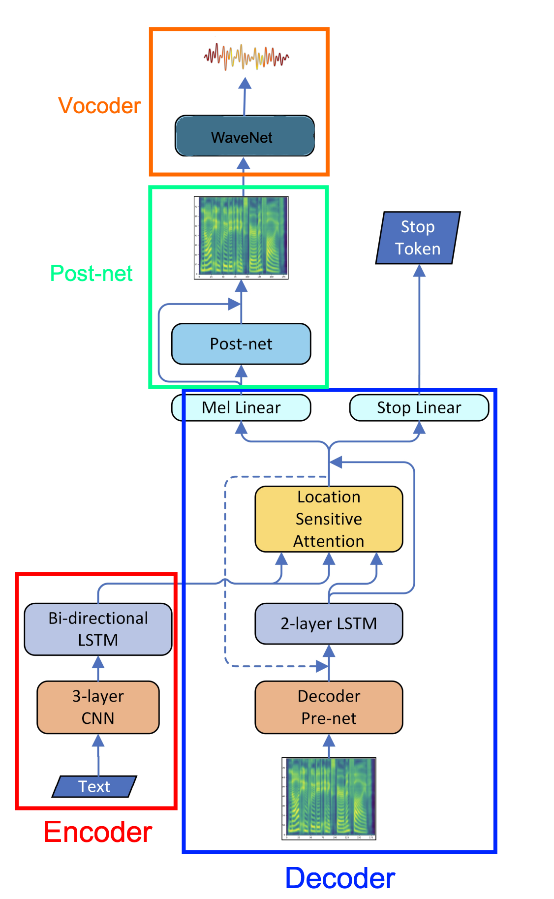
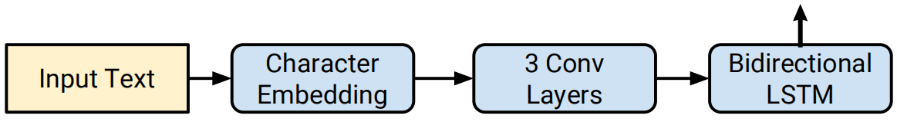
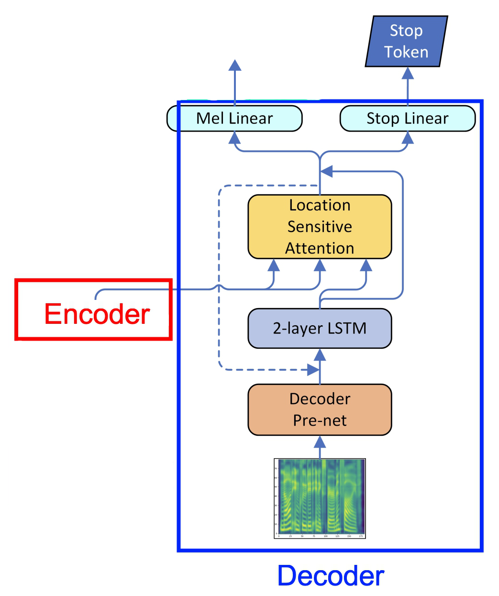
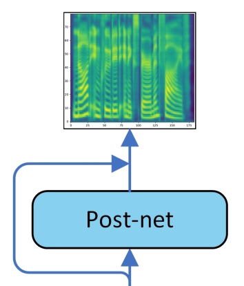
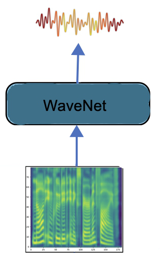
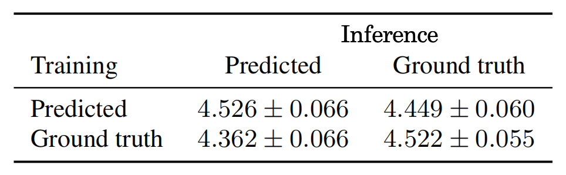
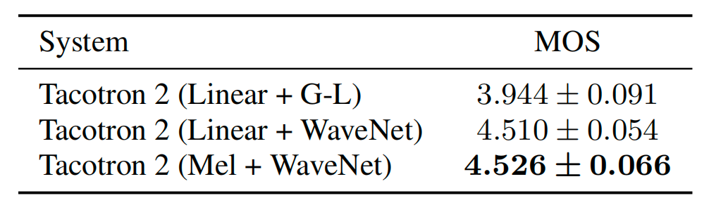
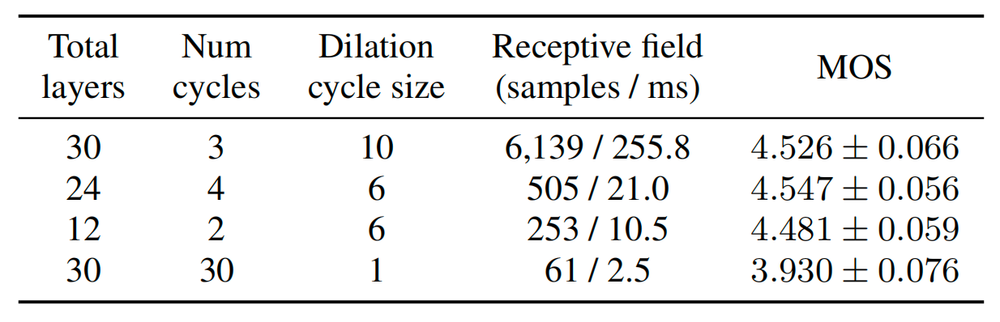

<h1 align="center">Tacotron 2: Phiên Bản "Pro Max" Ra Mắt! 🚀</h1>

---

Tưởng tượng cuối năm 2017, sau thành công vang dội của sản phẩm đầu tay, các nhà sáng lập của "Tacotron Inc." không ngủ quên trên chiến thắng. Họ ngay lập tức họp team lại và tuyên bố: "Phải làm ra một phiên bản xịn hơn nữa! Âm thanh phải thật như người!"

Thế là Tacotron 2 ra đời, vẫn với triết lý "quẳng cho nó sách và băng, nó tự biết bơi", nhưng với một sự thay đổi "chí mạng".

## The Biggest Upgrade: Diva "WaveNet" Lên Sàn! 🎤✨
Bạn còn nhớ anh chàng ca sĩ/nghệ nhân Griffin-Lim ở phiên bản đầu không? Anh ta là một thợ thủ công lành nghề, nhìn bản nhạc (spectrogram) là hát ra được ngay. Rất giỏi, nhưng giọng hát đôi khi vẫn còn hơi "máy móc", thiếu cảm xúc.

Giờ đây, "Tacotron Inc." đã sa thải anh ta và chiêu mộ một siêu sao ca nhạc, một diva đích thực tên là WaveNet.

**Griffin-Lim (Cũ):** Giống một nghệ nhân già, làm việc theo kinh nghiệm, không cần học hỏi thêm. "Đưa bản nhạc đây, tôi hát cho, đừng hỏi nhiều."

**WaveNet (Mới):** Là một thiên tài âm nhạc thực thụ! Cô ấy không chỉ hát, mà còn là một mạng lưới thần kinh (neural network) riêng. Cô ấy học cách biến bản nhạc thành âm thanh. Cô ấy có thể "cảm" được giai điệu, thêm vào những rung cảm tinh tế, những hơi thở tự nhiên mà không ai dạy. Cô ấy không phải là một "thợ hát", cô ấy là một NGHỆ SĨ.

=> Sự thay đổi này giống như việc bạn chuyển từ nghe một bản nhạc MIDI sang nghe một bản giao hưởng được trình diễn bởi dàn nhạc sống. Chất lượng âm thanh một trời một vực!

## Sơ Đồ Tổ Chức Mới của "Tacotron Inc. 2.0"
Về cơ bản, các phòng ban cốt lõi vẫn giữ nguyên:

- Phòng Phân Tích (Encoder)
- Phòng Sáng Tác (Decoder + Attention)
- Phòng Hậu Kỳ (Post-processing Network)

Nhưng thay đổi lớn nhất là phòng cuối cùng:

**Phòng Thanh Nhạc WaveNet (Vocoder Network):** Phòng này giờ đây không phải là một đối tác thuê ngoài nữa, mà là một bộ phận chính thức, một thành viên không thể thiếu của công ty. Toàn bộ hệ thống được thiết kế để "giao tiếp" và "hợp tác" chặt chẽ với Diva WaveNet.

## Bí Kíp Luyện Quân "Dị Hợm" Của Công Ty (Regularization)
Để đảm bảo các nhân viên AI của mình không trở nên lười biếng hay học vẹt, "Tacotron Inc. 2.0" áp dụng hai chính sách quản lý nhân sự cực kỳ lạ lùng:

**Dropout (Xác suất 0.5):** Dành cho các nhân viên bình thường (Convolutional layers). Cứ đang làm việc ngon lành, sếp lại chỉ ngẫu nhiên một người và hét: "Ê! Đi pha cà phê cho cả phòng!". Người này sẽ tạm thời "biến mất", buộc những người còn lại phải gồng gánh và tự tìm cách giải quyết công việc. Điều này giúp cả team trở nên mạnh mẽ, linh hoạt và không phụ thuộc vào bất kỳ cá nhân nào.

**Zoneout (Xác suất 0.1):** Dành cho các chuyên gia cao cấp (LSTM layers). Với những nhân vật quan trọng này, sếp không đuổi đi pha cà phê. Thay vào đó, sếp sẽ vỗ vai họ và nói: "Này anh bạn, 5 phút tới ngồi yên, 'zone out' đi, đừng làm gì cả!". Chuyên gia này sẽ tạm thời "đơ" ra, buộc các luồng suy nghĩ phải đi theo những con đường mới mẻ khác. Việc này giúp họ không bị đi vào lối mòn và luôn giữ được sự sáng tạo.

  

 

---

## Encoder (Phòng Phân Tích & Mã Hóa Thông Tin) 🕵️‍♂️

  

Anh chàng Encoder phiên bản 2.0 này giờ đây không còn là một tay mơ nữa, mà đã trở thành một chuyên gia phân tích siêu hạng. Đây là quy trình làm việc mới của anh ta:

### Bước 1: Cấp "Căn Cước Công Dân 512 Chiều" cho từng Chữ Cái (Character Embedding) 💳
Nếu ở phiên bản cũ, mỗi chữ cái chỉ được cấp một cái "mã vạch" đơn giản, thì bây giờ, mỗi chữ cái khi đi vào hệ thống sẽ được cấp ngay một cuốn "Căn cước công dân" siêu dày, siêu chi tiết.

"Learned 512-d character embedding": Cuốn căn cước này có tới 512 mục thông tin (chiều không gian)! Nó không chỉ ghi nhận chữ đó là chữ gì, mà còn ghi lại "tính cách", "họ hàng", "bạn bè" và tiềm năng kết hợp của chữ đó với các chữ khác. Ví dụ, chữ 'q' sẽ có một mục trong căn cước ghi rằng: "Rất thích đi chung với chữ 'u'".

=> Mục đích: Giúp hệ thống có một cái nhìn sâu sắc và đa chiều về từng "viên gạch" nhỏ nhất xây nên câu nói.

### Bước 2: Biệt Đội "Thám Tử Ngữ Cảnh" vào cuộc (3 Lớp Convolutional Layers) 🕵️‍♂️
Sau khi có căn cước xịn, hồ sơ của các chữ cái sẽ được chuyển cho một biệt đội thám tử tinh nhuệ gồm 3 lớp.

"A stack of 3 convolutional layers... with shape 5×1": Tưởng tượng có 3 đội thám tử xếp hàng nối đuôi nhau.

Đội 1 (Tân binh): Mỗi thám tử trong đội này chỉ nhìn vào một nhóm 5 chữ cái đứng cạnh nhau để tìm ra những manh mối cơ bản nhất (ví dụ: "à, đây là cụm 'xin ch' này!").

Đội 2 (Kinh nghiệm): Dựa trên báo cáo của Đội 1, đội này sẽ kết nối các manh mối nhỏ lại để tìm ra những cụm từ có ý nghĩa lớn hơn.

Đội 3 (Chuyên gia): Nhìn vào kết quả của Đội 2 để tìm ra các cấu trúc ngữ pháp và ngữ cảnh phức tạp hơn trong câu.

"Batch normalization and ReLU activations": Sau mỗi vòng điều tra, cả đội sẽ họp lại để "dọn dẹp hồ sơ" (batch normalization - thống nhất các báo cáo cho dễ đọc) và "chốt hạ vấn đề" (ReLU - quyết định manh mối nào là quan trọng cần giữ lại, manh mối nào là rác thì vứt đi).

=> Mục đích: Thay vì nhìn từng chữ riêng lẻ, biệt đội này giúp hệ thống hiểu được các cụm từ và ngữ cảnh cục bộ (như bigram, trigram,...) một cách hiệu quả.

### Bước 3: "Sếp Lớn" Đọc Xuôi Đọc Ngược Chốt Báo Cáo (Bi-directional LSTM) 🧠
Cuối cùng, toàn bộ hồ sơ vụ án đã được các thám tử phân tích sẽ được trình lên cho "Sếp Lớn" - một chuyên gia có siêu năng lực đặc biệt.

"A single bi-directional LSTM layer": Sếp Lớn này không đọc báo cáo theo cách thông thường.

Lượt đọc xuôi: Sếp đọc từ đầu đến cuối câu để nắm bắt mạch truyện tự nhiên.

Lượt đọc ngược: Ngay sau đó, Sếp lại đọc từ cuối câu ngược về đầu! Việc này giúp sếp "ngộ" ra những ý nghĩa ẩn sâu hoặc những mối liên hệ mà cách đọc thông thường không thể thấy được. Ví dụ, đọc đến cuối câu mới biết đây là câu hỏi hay câu khẳng định.

Sếp Lớn này có một bộ não siêu khủng (512 units), một nửa (256 units) chuyên để đọc xuôi và nửa còn lại (256 units) chuyên để đọc ngược.

=> Mục đích: Tạo ra một sự thấu hiểu toàn diện và sâu sắc nhất về ý nghĩa của cả câu văn, không bỏ sót bất kỳ chi tiết nào.

## Decoder + Attention Mechanism (Phòng Sáng Tác Âm Nhạc) 🎼

  

 

## Nâng cấp lớn nhất: Giám Thị Giờ Đã Có "GPS Định Vị" (Location Sensitive Attention) 🗺️
Bạn còn nhớ "Giám Thị Khó Tính" ở phiên bản cũ không? Ông ta chỉ biết dí đèn laser vào từng chữ để Nhà Soạn Nhạc tập trung. Nhưng đôi khi ông ta cũng bị "lú", có thể chỉ đi chỉ lại một chỗ hoặc bị phân tâm.

Giờ đây, ông Giám Thị đã được trang bị một hệ thống GPS siêu cấp:

"Location Sensitive Attention": Trước khi bắt đầu, ông Giám Thị không chỉ nhìn vào bản báo cáo của Encoder, mà còn trải một tấm bản đồ ra bàn. Mỗi lần ông dí đèn laser vào một chữ, ông sẽ lấy bút đánh dấu "X" vào vị trí đó trên bản đồ.

Lợi ích: Ông ta luôn biết mình đã đi qua những đâu. Điều này giúp ông:

Không bao giờ lặp lại: Sẽ không có chuyện đọc đi đọc lại một từ.

Di chuyển tuần tự: Luôn biết chữ tiếp theo cần tập trung là chữ nào, giúp dòng chảy âm nhạc mượt mà như lướt trên băng.

Không bị lạc: Dù câu có dài và phức tạp đến đâu, ông cũng không bao giờ bị "mất dấu".

## Quy Trình Sáng Tác Mới: Tỉ Mỉ Từng Nốt Nhạc 🎶
Dây chuyền sản xuất "bản đồ âm thanh" giờ đây đã trở nên tinh vi hơn rất nhiều.

Khởi động (<GO> frame & Pre-net): Sếp gõ búa ra hiệu bắt đầu từ một khoảng lặng. Nhà Soạn Nhạc lấy nốt nhạc vừa được tạo ra ở bước trước (hoặc khoảng lặng nếu là đầu tiên), cho qua một cái "máy khởi động ý tưởng" (Pre-net) để "mồi" cho quá trình sáng tạo.

**Team-work đỉnh cao (Concatenation):**

Giám Thị GPS chiếu đèn laser vào chữ cần phổ nhạc và đưa ra "chỉ thị" của mình.

Nhà Soạn Nhạc lấy "ý tưởng mồi" từ máy khởi động và "chỉ thị" của Giám Thị, dùng băng dính dán chúng lại với nhau.

Bộ Não 2 Tầng Siêu Khủng (2 uni-directional LSTM layers): Mẩu giấy dán này được đưa vào bộ não sáng tạo của Nhà Soạn Nhạc. Nếu ngày xưa não anh ta chỉ có 1 tầng, thì giờ nó đã được nâng cấp lên 2 tầng với sức mạnh tính toán khổng lồ (1024 units). Anh ta nghiền ngẫm, phân tích và...

## Hai "Cú Hít" Tạo Nên Sự Khác Biệt! 💥
Đây là lúc điều kỳ diệu xảy ra. Thay vì chỉ cho ra một kết quả, bộ não của Nhà Soạn Nhạc giờ đây hoạt động song song và cho ra HAI SẢN PHẨM cùng lúc:

1. **Sản phẩm chính: Nốt Nhạc Siêu Chi Tiết 🎼**  
"Predict the target spectrogram frame": Anh ta tỉ mỉ viết ra duy nhất MỘT nốt nhạc (một khung spectrogram).

Sự khác biệt chí mạng: Ở phiên bản cũ, để cho nhanh, anh ta viết luôn một lúc cả cụm vài nốt nhạc. Nhưng ở phiên bản 2.0, anh ta cẩn thận nắn nót từng nốt một. Điều này giống như một họa sĩ vẽ từng nét cọ tinh xảo thay vì tô màu theo mảng lớn. Chất lượng âm thanh chi tiết và tự nhiên hơn hẳn!

2. **Sản phẩm phụ: "Trợ Lý Biết Điều" & Cái Nút Dừng 🛑**  
"Predict the probability that the output sequence has completed": Cùng lúc đó, một "trợ lý" đứng bên cạnh quan sát và giơ một tấm bảng điểm.

Nếu câu văn vẫn còn dài, trợ lý giơ bảng 0% ("Cứ tiếp tục đi sếp ơi!").

Khi thấy câu văn sắp kết thúc, trợ lý bắt đầu giơ bảng điểm cao dần: 50%... 80%...

Khi câu văn đã hết ý, trợ lý giơ bảng 99.9% và hét to: "DỪNG LẠI! HẾT VIỆC RỒI SẾP ƠI!"

Lợi ích: Đây là một phát minh thiên tài! Hệ thống giờ đây có thể tự động nhận biết khi nào nên kết thúc, thay vì cứ "hát" mãi một cách ngớ ngẩn hoặc dừng lại đột ngột. Giọng nói trở nên tự nhiên như con người, biết khi nào cần phải ngắt nghỉ.

Tóm lại quy trình sáng tác 2.0:

Giám Thị GPS chỉ điểm ➡️ Nhà Soạn Nhạc dùng não 2 tầng ➡️ Viết ra 1 NỐT NHẠC cực xịn + Nhờ Trợ Lý kiểm tra xem CÓ NÊN DỪNG không? ➡️ Nốt nhạc vừa tạo lại được dùng làm "mồi" cho vòng tiếp theo... và cứ thế lặp lại.

## Post-processing Network (Phòng Hậu Kỳ & Mix Nhạc) ✨

  

 

Nếu Phòng Sáng Tác tạo ra một bản nhạc hay, thì phòng này sẽ biến nó thành một kiệt tác. Hãy coi đây là một "Spa 5 Sao Cao Cấp" dành riêng cho âm thanh.

### Mục Tiêu: "Đánh Bóng Kim Cương" 💎
Bản đồ âm thanh (mel-spectrogram) mà "Phòng Sáng Tác" gửi qua đã rất xịn rồi, giống như một viên kim cương thô. Nhiệm vụ của phòng Hậu Kỳ là mài giũa, đánh bóng để viên kim cương đó trở nên long lanh, hoàn hảo không tì vết trước khi đưa cho Diva WaveNet thể hiện.

### Quy Trình "Spa Âm Thanh" 5 Bước (5 Convolution Layers)
Bản nhạc thô được đưa vào một liệu trình chăm sóc đặc biệt gồm 5 phòng, mỗi phòng có một đội ngũ chuyên gia riêng.

"5 convolution layers... 512 filters with shape 5×1": Tưởng tượng mỗi phòng spa có 512 chuyên gia thẩm mỹ. Mỗi chuyên gia chỉ tập trung vào một vùng da rất nhỏ (một đoạn nhạc dài 5 nốt) để "soi" và xử lý từng lỗi li ti như nốt phô, âm rè, hay nhịp điệu chưa mượt. Họ cực kỳ tỉ mỉ!

"batch normalization": Sau khi ra khỏi mỗi phòng, bản nhạc sẽ được đi qua khu vực "thanh lọc & cân bằng". Bước này giống như việc rửa mặt và cân bằng lại độ pH cho da, đảm bảo mọi thứ được sạch sẽ, thống nhất trước khi bước vào liệu trình tiếp theo. Điều này giúp các lỗi nhỏ không bị cộng dồn và trở nên nghiêm trọng hơn.

"tanh activations": Ở 4 phòng đầu tiên, sau khi "chăm sóc da", các chuyên gia sẽ bôi một loại "serum cảm xúc" (tanh) giúp âm thanh trở nên sống động, có hồn và biểu cảm hơn. Phòng cuối cùng thì không cần, vì đó là bước hoàn thiện cuối cùng rồi, chỉ cần "chốt hạ" là xong!

### Vũ Khí Tối Thượng: "Lối Tắt Ký Ức" (Residual Connections) 🧠
Đây chính là bí quyết làm nên tên tuổi của "Spa 2.0" và là nâng cấp vượt trội so với phiên bản cũ.

Hãy tưởng tượng thế này:

Chụp ảnh "Trước Khi Spa" 📸: Trước khi bản nhạc bước vào một phòng spa nào đó, một chiếc máy ảnh sẽ chụp lại hiện trạng "mộc" của nó.

Tiến hành "Tút Tát": Các chuyên gia trong phòng sẽ thực hiện công việc mài giũa của mình.

Soi Gương So Sánh: Sau khi làm xong, thay vì cứ thế đưa sản phẩm mới đi tiếp, họ sẽ lấy sản phẩm vừa làm xong đặt cạnh tấm ảnh "trước khi spa".

Chỉ Giữ Lại Cái Tốt Hơn: Họ chỉ lấy phần khác biệt, phần cải tiến và đắp nó lên bản gốc.

Tại sao phải làm vậy?

Điều này để đảm bảo rằng các chuyên gia không "hăng say" quá mà "chữa lợn lành thành lợn què". Nó đảm bảo rằng kết quả cuối cùng luôn luôn là bản gốc cộng thêm những cải tiến tích cực. Nhờ vậy, chất lượng âm thanh sẽ chỉ có tốt lên chứ không bao giờ tệ đi, dù có đi qua bao nhiêu lớp xử lý đi nữa.

Tóm lại một cách siêu ngắn gọn:

Post-Network chính là một spa 5 sao, nơi bản nhạc thô được một đội ngũ chuyên gia "mát-xa", "đắp mặt nạ", "thanh lọc" qua 5 bước. Bí quyết của họ là luôn so sánh sản phẩm "sau khi spa" với ảnh gốc để đảm bảo chỉ giữ lại những gì tốt đẹp nhất!

## Vocoder

  

Nếu Post-Network là một spa 5 sao, thì WaveNet chính là nghệ sĩ/maestro thiên tài biến bản nhạc đã được đánh bóng trên giấy thành một màn trình diễn âm thanh live lay động lòng người.

### Nhiệm Vụ: "Thổi Hồn" Vào Bản Nhạc 🌬️🎶
WaveNet nhận lấy bản đồ âm thanh (mel-spectrogram) siêu đẹp từ phòng Hậu Kỳ. Nhưng đó vẫn chỉ là "xác" của âm thanh. Nhiệm vụ của cô là "thổi hồn" vào đó, biến những chỉ dẫn trên giấy thành sóng âm thanh thực thụ, chi tiết đến từng mili giây.

Cô không hát theo kiểu thông thường. Cô KIẾN TẠO âm thanh. Hãy tưởng tượng cô là một nhà điêu khắc, tỉ mỉ tạc nên từng gợn sóng của âm thanh một cách chính xác tuyệt đối.

### Tuyệt Kỹ #1: "Thiên Lý Nhãn" Âm Nhạc (Dilated Convolutions) 👀
Để tạo ra âm thanh chân thực, WaveNet cần một khả năng cảm thụ âm nhạc phi thường. Cô sở hữu một "con mắt thứ ba" cho phép cô nhìn thấu bối cảnh của bản nhạc.

"30 dilated convolution layers": Hãy tưởng tượng WaveNet có 30 cặp mắt.

Cặp mắt đầu tiên chỉ nhìn vào nốt nhạc ngay sát bên cạnh.

Cặp mắt thứ hai nhìn xa hơn, cách 2 nốt.

Cặp mắt thứ ba nhìn xa hơn nữa, cách 4 nốt, rồi 8 nốt...

Kết quả: Cùng một lúc, cô vừa có thể thấy chi tiết của nốt nhạc kế tiếp, vừa bao quát được giai điệu của cả một đoạn nhạc dài phía sau. Điều này giúp cô tạo ra âm thanh có tính liên kết, mượt mà và tự nhiên, chứ không bị rời rạc như robot.

### Tuyệt Kỹ #2: Bảng Pha Chế Âm Thanh "Thần Sầu" (Mixture of Logistic Distributions - MoL) 🎨🧪
Đây mới là bí mật kinh khủng nhất làm nên tên tuổi của Diva WaveNet!

Các ca sĩ robot đời cũ (như trong game 8-bit) khi tạo âm thanh, chúng chỉ có một bộ "bút chì màu" với vài màu cơ bản để chọn. Âm thanh vì thế rất thô và giả.

Còn WaveNet thì khác. Cô không dùng bút chì màu. Cô là một bậc thầy pha chế với một bảng màu gồm 10 loại "sơn xác suất" khác nhau.

"10-component mixture of logistic distributions (MoL)": Với mỗi một gợn sóng âm thanh siêu nhỏ mà cô cần tạo ra, cô không chọn một giá trị duy nhất. Thay vào đó, cô làm như sau:

Lấy ra 10 lọ sơn (10 distributions).

Mỗi lọ sơn có một "màu chủ đạo" (mean), một độ "loang" (log scale) và một "tỷ lệ pha" (mixture weight) riêng.

Cô kết hợp 10 lọ sơn này theo một công thức bí truyền, pha trộn chúng lại với nhau.

Kết quả? Cô có thể tạo ra hàng triệu sắc thái âm thanh tinh vi mà không một bộ bút chì màu nào có thể làm được. Nó tạo ra sự phong phú, độ sâu và những rung động cực kỳ tự nhiên trong giọng nói.

### Quá Trình Luyện Công (Training)
Làm sao WaveNet biết cách pha chế "thần sầu" như vậy? Cô phải luyện tập!

"Negative log-likelihood of the ground truth": Quá trình luyện tập của cô là nghe đi nghe lại giọng hát của ca sĩ người thật (ground truth).

Cô thử "pha chế" và tạo ra một gợn sóng âm thanh của riêng mình.

Sau đó, cô so sánh nó với bản gốc. Nếu khác xa quá, hệ thống sẽ "phạt" cô rất nặng (loss cao).

Bị phạt đau, cô sẽ tự rút kinh nghiệm và điều chỉnh lại công thức pha chế của mình cho lần sau.

Cứ như vậy hàng triệu lần, cô trở thành một nghệ sĩ có khả năng tái tạo giọng nói gần như hoàn hảo.

Tóm lại:

Vocoder (WaveNet) là một Diva thiên tài, người sử dụng "Thiên Lý Nhãn" để nhìn thấu bản nhạc và dùng "Bảng Pha Chế Âm Thanh 10 Lọ Sơn" để kiến tạo nên từng gợn sóng âm thanh một cách siêu thực, mang lại giọng nói tự nhiên đến kinh ngạc cho Tacotron 2.

---

## Cuộc Đại Chiến Tay Đôi: Tacotron 1 vs. Tacotron 2 🥊
Hãy cùng đặt hai "nhân viên thiên tài" này lên bàn cân để xem ai hơn ai nhé!

1. **Bộ Não Chính (LSTM vs. GRU):**
   - **Tacotron 1:** Dùng anh chàng **GRU**, thông minh, nhanh nhẹn, gọn gàng.
   - **Tacotron 2:** Chơi lớn, thuê hẳn "lão làng" **LSTM**. Ông này có một cuốn "sổ tay ghi chép" riêng nên nhớ được những ngữ cảnh siêu dài và phức tạp, tuy hơi cồng kềnh nhưng bộ nhớ "khủng" hơn hẳn.

2. **Đội Ngũ Phân Tích (CBHG vs. Convolutional Layers):**
   - **Tacotron 1:** Dựa vào "siêu trợ lý đa tài" **CBHG**, một mình cân team từ A-Z.
   - **Tacotron 2:** Chuyên môn hóa! Lập ra một **"biệt đội thám tử" (Convolutional layers)** chuyên nghiệp. Mỗi người một việc, phối hợp nhịp nhàng, hiệu quả và sâu sắc hơn.

3. **Tốc Độ Sáng Tác (Reduction Factor):**
   - **Tacotron 1:** Hơi "ăn gian", viết nhạc theo kiểu "vơ cả cụm", một lần viết ra vài nốt nhạc cho nhanh.
   - **Tacotron 2:** Cực kỳ tỉ mỉ! Nắn nót viết **từng nốt một**. Tuy chậm hơn về lý thuyết nhưng chất lượng chi tiết và tinh xảo hơn gấp bội.

4. **Nghệ Sĩ Trình Diễn (Griffin-Lim vs. WaveNet):**
   - **Tacotron 1:** Thuê "anh thợ hát" **Griffin-Lim** lành nghề, hát đúng nhạc nhưng hơi khô khan.
   - **Tacotron 2:** Chiêu mộ "Diva thiên tài" **WaveNet**, người không chỉ hát mà còn "thổi hồn" vào bản nhạc. Đây là nâng cấp **ăn tiền nhất**!

5. **Loại Bản Nhạc (Linear vs. Mel Spectrogram):**
   - **Tacotron 1:** Vẽ ra bản nhạc kiểu "kỹ thuật" (Linear), ghi lại tất cả tần số, kể cả những cái tai người không nghe rõ.
   - **Tacotron 2:** Vẽ bản nhạc kiểu "tâm lý học" (Mel), tập trung vào những tần số mà tai người nhạy cảm nhất. Thông minh và hiệu quả hơn!

---

## Khóa Huấn Luyện Đặc Biệt & Lễ Tốt Nghiệp 🏆
Quá trình "đào tạo" Tacotron 2 cũng chuyên nghiệp hơn hẳn, chia làm 2 giai đoạn rõ rệt:

- **Giai đoạn 1: Luyện "Lý Thuyết" cho Team Sáng Tác:** Toàn bộ đội ngũ từ Encoder đến Post-Network (trừ Diva WaveNet) được nhốt vào phòng để luyện tập cách biến chữ thành bản nhạc hoàn hảo.
- **Giai đoạn 2: Luyện "Thực Hành" cho Diva:** Sau khi đã có những bản nhạc siêu chất lượng, họ mới đưa cho Diva WaveNet để cô luyện tập cách "thổi hồn" vào đó. Giai đoạn này cần sức mạnh khủng khiếp, phải huy động tới **32 GPU** (như một dàn nhạc 32 người hỗ trợ Diva luyện giọng).

### Kết Quả Kỳ Thi Tốt Nghiệp (MOS - Mean Opinion Score):
Đây là lúc "khán giả" (người nghe thật) chấm điểm độ tự nhiên của giọng nói trên thang 5.

| Thí Sinh | Điểm Bình Chọn (MOS) | Lời Bình Hài Hước |
| :--- | :---: | :--- |
| **Giọng Người Thật (Ground Truth)** | **4.58** | 👑 "Bản gốc không thể chê vào đâu được!" |
| **Tacotron 2** | **4.53** | 🥈 **"Á QUÂN SÁT NÚT!** Hát hay đến mức suýt lừa được cả ban giám khảo!" |
| WaveNet (đứng một mình) | 4.21 | 🥉 "Diva hát rất hay, nhưng không có nhạc sĩ tốt thì vẫn chưa đỉnh." |
| Tacotron 1 | 3.82 | 🏅 "Thiên tài đời đầu, rất đáng nể nhưng đã đến lúc về hưu." |
| Parametric (Đối thủ khác) | 3.69 | "Giọng hát ổn, nhưng vẫn nghe ra mùi robot." |
| Concatenative (Đối thủ khác) | 4.09 | "Giọng trong trẻo nhưng đôi khi hơi giật cục." |

=> **Kết luận:** Tacotron 2 đã tạo ra một cú sốc lớn, đạt điểm số gần như **chạm nóc** so với giọng người thật, chính thức trở thành "Ông Vua" mới của làng tổng hợp giọng nói!

---

## Phòng Thí Nghiệm "Lỡ May Thì Sao?" (Ablation Study) 🔬
Các nhà khoa học không dừng lại ở đó. Họ còn "nghịch ngợm" bằng cách thay đổi một vài bộ phận của Tacotron 2 để xem chuyện gì sẽ xảy ra.

- **Thí nghiệm 1: "Cho Diva học vẹt thì sao?"**
  - **Kịch bản:** Bắt Diva WaveNet chỉ luyện tập với bản nhạc của người thật (ground truth), sau đó quẳng cho cô ấy bản nhạc do team Tacotron 2 sáng tác.
  - **Kết quả:** Diva bị "khớp"! Cô phàn nàn: "Bản nhạc này hơi 'lạ', không giống cái tôi được học!". Chất lượng âm thanh tệ đi.
  - **Bài học:** Nhạc sĩ và ca sĩ phải **luyện tập cùng nhau** thì mới thành một cặp đôi hoàn hảo được.

  

- **Thí nghiệm 2: "Dùng lại bản nhạc cũ (Linear) thì sao?"**
  - **Kịch bản:** Bắt Tacotron 2 tạo ra bản nhạc kiểu "kỹ thuật" của Tacotron 1.
  - **Kết quả:** Chẳng khác biệt nhiều!
  - **Bài học:** Diva WaveNet quá "bá đạo"! Đưa cho cô ấy loại bản nhạc nào, cô ấy cũng có thể biến nó thành một kiệt tác. Vấn đề không nằm ở bản nhạc, mà là ở tài năng của ca sĩ.

  

- **Thí nghiệm 3: "Bắt Diva hát với dàn nhạc 'mini' thì sao?"**
  - **Kịch bản:** Giảm bớt sức mạnh của WaveNet, từ 30 lớp "thiên lý nhãn" xuống chỉ còn 12 lớp.
  - **Kết quả:** Chất lượng vẫn rất cao!
  - **Bài học:** WaveNet không chỉ mạnh mà còn cực kỳ hiệu quả. Cô không cần quá nhiều "đồ chơi" xịn sò để tạo ra âm thanh đỉnh cao. Đúng là đẳng cấp của một siêu sao!

  

